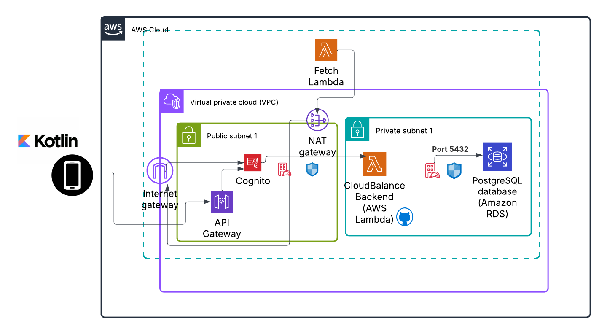

# Cloud Balance Terraform Infrastructure

This repository contains Terraform code for deploying the infrastructure of the **Cloud Balance** project, a cloud cost and resource management platform.

## Overview

The Terraform configuration provisions the following components on AWS:

- **Amazon RDS PostgreSQL**: Stores user data, AWS cost/resource metadata, and alert settings.
- **AWS Lambda**: Runs the backend Node.js API (deployed from `lambda.zip`).
- **Amazon API Gateway**: Exposes the backend Lambda function as an HTTP API.
- **Amazon Cognito**: Handles user authentication and authorization.
- **IAM Roles & Policies**: Secure Lambda execution and VPC access.
- **VPC Security Groups**: Restrict RDS and Lambda traffic within a private network.

## Directory Structure

- `main.tf`: Main Terraform configuration file.
- `variables.tf`: Declares required variables like DB name, username, password.
- `terraform.tfvars`: Supplies the values for declared variables.
- `lambda.zip`: Zipped backend code (`src/`, `node_modules`, and `package.json`).

## Getting Started

### 1. Zip the Lambda Code

```bash
cd ../cloud-balance-backend
zip -r ../terraform-aws-backend/lambda.zip src node_modules package.json
```

### 2. Deploy with Terraform

```bash
cd ../terraform-aws-backend
terraform init
terraform plan         # Review changes
terraform apply        # Apply infrastructure
```

## Outputs

After deployment, Terraform will output:

- `api_gateway_url`: Public URL of the API Gateway
- `rds_endpoint`: Hostname of the RDS PostgreSQL instance
- `cognito_user_pool_id`: Cognito User Pool ID
- `cognito_user_pool_client_id`: App client ID
- `cognito_user_pool_domain`: Cognito hosted domain for login/redirect

## System Architecture

The diagram below illustrates how the Cloud Balance mobile app, backend API, AWS Lambda functions, and PostgreSQL database interact across public and private cloud environments.



## Notes

- The API Gateway is secured with a Cognito JWT authorizer.
- Lambda has VPC access to communicate with RDS.
- The infrastructure is region-specific (set to `us-east-1` by default).
- Subnet and VPC IDs are hardcoded — make sure they match your AWS account.

## License

MIT — see [LICENSE](LICENSE) for details.

---

## ✨ Credits

Part of the **Cloud Balance** final year project.
Maintained by [Kate](https://github.com/katmolony).
